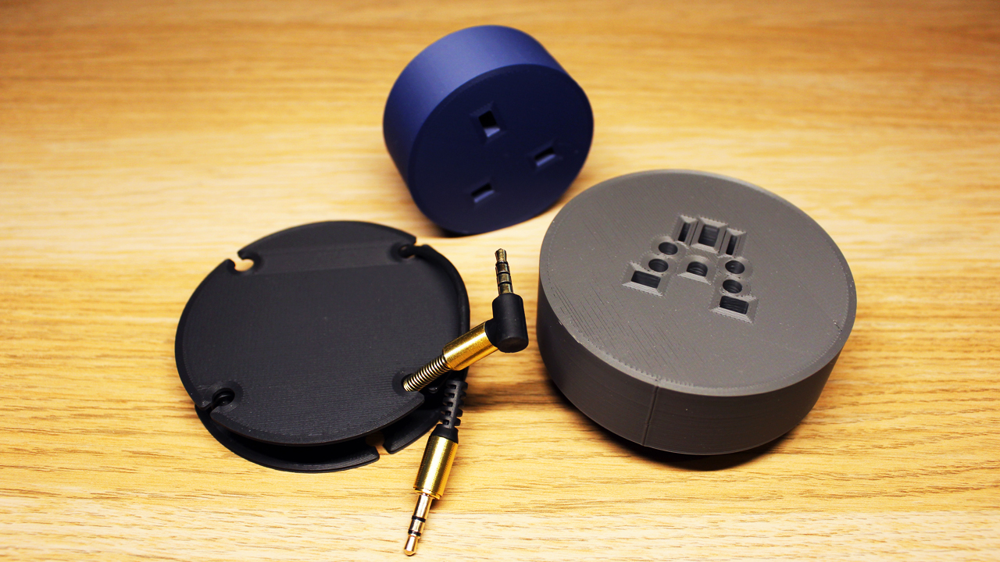

# Wire organisers

This repo is only used to host the 3D files for the wire organisers. There is a [video](https://youtu.be/gwGwXnJ0ZIU) showcasing and explaining the organisers. I highly recommend watching it if you are going to be using these 3D models.

# Types

* The first wire organiser (WO1) is for wires such as USB cables and small wires.
* The second wire organiser (WO2) is for wires with a socket, where the socket gets inserted directly into the wire organiser. This is only for UK plugs.
* The third wire organiser (WO3) is the same as WO2, but supports the UK, and Type A, B, C, F sockets.

# Sizes

There the are two sizes to choose from depending on how long your wire is.

* The small is 8cm in diameter
* The large is 10cm in diameter.

# How to print

Each wire organiser is made up of two parts, the bottom part and the top part.

* The bottom part is the same for both types of wire organisers, so just choose the size for that one.
* For the top part, just choose the type you want, for wires with or without a socket.

If any of this is confusing, I recommend watching the [video](https://youtu.be/gwGwXnJ0ZIU) to understand it all.

# 3D models

- For the small version, refer to the `/small(8cm)` directory.
- For the large version, refer to the `/large(10cm)` directory.